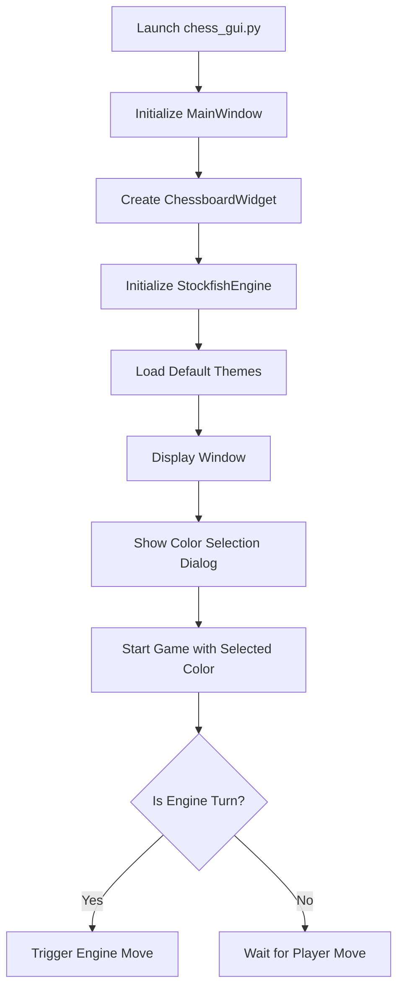
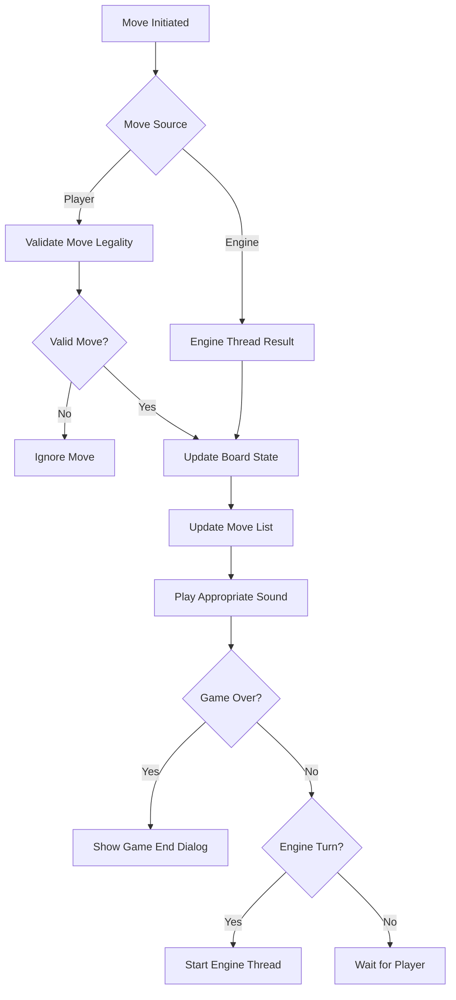
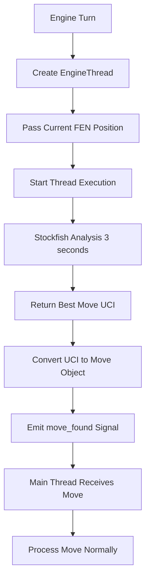

# Chess Engine & GUI Documentation

## Table of Contents
1. [Project Overview](#project-overview)
2. [Architecture](#architecture)
3. [Installation & Setup](#installation--setup)
4. [File Structure](#file-structure)
5. [Core Components](#core-components)
6. [Workflows](#workflows)
7. [GUI Components](#gui-components)
8. [Engine Implementation](#engine-implementation)
9. [Game Logic](#game-logic)
10. [Sound System](#sound-system)
11. [Theming System](#theming-system)
12. [Configuration](#configuration)
13. [Development Guide](#development-guide)
14. [Troubleshooting](#troubleshooting)

## Project Overview

This is a comprehensive chess application built in Python featuring:
- **PyQt5-based graphical user interface** with drag-and-drop piece movement
- **Stockfish engine integration** for AI opponents at full strength (depth 20)
- **Multiple board and piece themes** for customization
- **Sound effects** for different game events
- **UCI protocol support** for engine communication
- **FEN position loading** for custom game positions
- **Modular architecture** for easy maintenance and extension

The application supports both human vs computer gameplay and can serve as a UCI-compliant chess engine for external chess GUIs.

## Architecture

The project follows a modular architecture pattern:

```
Chess Application
├── GUI Layer (PyQt5)
│   ├── Main Window (chess_gui.py)
│   ├── Chessboard Widget
│   ├── Dialogs (Color Selection, Promotion, Settings)
│   └── Theme Management
├── Engine Layer
│   ├── Stockfish Wrapper (stockfish_engine.py)
│   ├── Engine Thread (for non-blocking moves)
│   └── UCI Interface (main.py)
├── Game Logic
│   ├── Chess Library (python-chess)
│   ├── Move Validation
│   └── Game State Management
└── Assets
    ├── Piece Themes (SVG files)
    └── Sound Effects (MP3 files)
```

## Installation & Setup

### Prerequisites
- Python 3.7+
- PyQt5
- python-chess library
- stockfish library
- Stockfish binary installed on system

### Installation Steps

1. **Create and activate virtual environment:**
   ```bash
   python -m venv .venv
   source .venv/bin/activate  # On Windows: .venv\Scripts\activate
   ```

2. **Install dependencies:**
   ```bash
   pip install -r requirements.txt
   ```

3. **Install Stockfish binary:**
   - **macOS (Homebrew):** `brew install stockfish`
   - **Ubuntu/Debian:** `sudo apt install stockfish`
   - **Windows:** Download from official Stockfish website

4. **Set Stockfish path (if needed):**
   ```bash
   export STOCKFISH_BINARY=/path/to/stockfish
   ```

### Running the Application

- **GUI Mode:** `python chess_gui.py`
- **UCI Mode:** `python main.py`

## File Structure

```
chess_project/
├── chess_gui.py              # Main GUI application
├── main.py                   # UCI interface for engine communication
├── stockfish_engine.py       # Stockfish wrapper class
├── requirements.txt          # Python dependencies
├── CLAUDE.md                 # Development instructions
├── README.md                 # Basic project information
├── documentation.md          # This file
├── gui_components/           # Modular GUI components
│   ├── __init__.py
│   ├── chessboard.py        # Chess board widget with piece rendering
│   ├── dialogs.py           # Color selection, promotion dialogs
│   ├── engine_thread.py     # Threading for engine calculations
│   ├── settings.py          # Settings dialog
│   └── themes.py            # Board theme definitions
├── piece/                   # SVG piece themes (35+ themes)
│   ├── cburnett/           # Default piece theme
│   ├── alpha/
│   ├── cardinal/
│   └── ... (30+ other themes)
└── sound/                  # Game sound effects
    ├── capture.mp3
    ├── castle.mp3
    ├── check.mp3
    ├── game-end.mp3
    ├── game-start.mp3
    ├── move.mp3
    └── promote.mp3
```

## Core Components

### 1. Main Window (`chess_gui.py`)

**Purpose:** Entry point and orchestrator for the entire GUI application.

**Key Responsibilities:**
- Window setup and layout management
- Game state management (board position, turn, game over)
- Sound playback coordination
- Engine communication orchestration
- Settings persistence

**Key Methods:**
- `__init__()`: Initialize window, board, engine, and UI components
- `start_game()`: Begin new game with color selection
- `handle_move()`: Process player/engine moves with validation
- `play_sound()`: Trigger appropriate sound effects
- `show_game_end_dialog()`: Display game result with rematch option

### 2. Stockfish Engine Wrapper (`stockfish_engine.py`)

**Purpose:** Provides a clean interface to the Stockfish chess engine.

**Key Features:**
- Automatic Stockfish binary detection across platforms
- Full strength play (depth 20, no ELO limiting)
- 3-second time-limited moves for consistent pacing
- Error handling and fallback mechanisms

**Key Methods:**
- `__init__()`: Initialize engine with optimal parameters
- `get_best_move()`: Calculate best move for given position
- `get_evaluation()`: Evaluate position strength
- `is_available()`: Check engine availability

**Engine Configuration:**
```python
default_params = {
    "Threads": 2,
    "Hash": 64,  # 64MB hash table
    "Skill Level": 20,  # Maximum strength
    "UCI_LimitStrength": "false",  # No strength limiting
    "Move Overhead": 10,
    "Minimum Thinking Time": 20,
}
```

### 3. Chess Board Widget (`gui_components/chessboard.py`)

**Purpose:** Handles all chess board rendering and user interactions.

**Key Features:**
- Drag-and-drop piece movement with visual feedback
- Legal move highlighting (dots for normal moves, rings for captures)
- Board flipping for black player perspective
- Last move highlighting
- Promotion dialog integration
- SVG-based piece rendering for crisp graphics

**Rendering Pipeline:**
1. Draw board squares with theme colors
2. Highlight last move if available
3. Show legal move hints during piece dragging
4. Render pieces (except currently dragged piece)
5. Render dragged piece at cursor position

**Mouse Event Handling:**
- `mousePressEvent()`: Start piece dragging if valid
- `mouseMoveEvent()`: Update drag position and visual feedback
- `mouseReleaseEvent()`: Complete move or handle promotion

## Workflows

### Game Initialization Workflow



### Move Processing Workflow



### Engine Move Calculation Workflow



## GUI Components

### Dialog System (`gui_components/dialogs.py`)

#### Color Selection Dialog
- **Purpose:** Allow player to choose White or Black pieces
- **Trigger:** New game initialization
- **Result:** Sets `player_color` and `board_flipped` properties

#### Promotion Dialog
- **Purpose:** Handle pawn promotion to Queen, Knight, Rook, or Bishop
- **Features:**
  - Chess.com-style vertical layout
  - SVG piece previews matching current theme
  - Cancellation option with X button
  - Automatic positioning near promotion square

#### Promotion Piece Button
- **Custom Widget:** Renders SVG pieces with hover effects
- **Hover Behavior:** Light gray background on mouse over
- **Click Handling:** Executes callback to select piece type

### Settings System (`gui_components/settings.py`)

#### Settings Dialog Structure
- **Tab-based interface** (currently single "Appearance" tab)
- **Piece Theme Selection:** Dropdown with all available themes
- **Board Theme Selection:** Dropdown with 13 predefined color schemes
- **Real-time Preview:** Changes apply immediately upon OK

#### Theme Discovery
- **Automatic Detection:** Scans `piece/` directory for theme folders
- **Validation:** Ensures each theme has complete piece set (12 SVG files)
- **Fallback:** Defaults to "cburnett" theme if issues occur

### Threading System (`gui_components/engine_thread.py`)

#### Engine Thread Class
- **Purpose:** Prevent GUI blocking during engine calculations
- **Inheritance:** Extends `QThread` for proper Qt integration
- **Signal System:** Uses `move_found` signal for thread communication
- **Error Handling:** Emits None for failed move calculations

#### Thread Safety
- **Main Thread:** GUI updates, user interactions
- **Engine Thread:** Stockfish communication only
- **Communication:** Qt signal/slot mechanism ensures thread safety

## Engine Implementation

### Stockfish Integration

#### Binary Discovery Algorithm
```python
def _find_stockfish_binary():
    candidates = [
        os.environ.get("STOCKFISH_BINARY"),     # Environment variable
        "/opt/homebrew/bin/stockfish",          # macOS Apple Silicon
        "/usr/local/bin/stockfish",             # macOS Intel/Linux
        "/usr/bin/stockfish",                   # Standard Linux
        "stockfish",                            # System PATH
    ]
    # Return first executable found
```

#### Move Generation Process
1. **Position Setup:** Load current game state via FEN
2. **Engine Configuration:** Ensure maximum strength settings
3. **Move Search:** 3-second time limit for consistent gameplay
4. **Result Processing:** Convert engine UCI to python-chess Move object
5. **Error Handling:** Fallback to random legal move if engine fails

### UCI Protocol Implementation (`main.py`)

#### Supported UCI Commands
- `uci`: Engine identification and options
- `isready`: Readiness confirmation  
- `ucinewgame`: Reset game state
- `position startpos/fen`: Set board position
- `go`: Begin move calculation
- `quit`: Terminate engine

#### UCI Response Format
```
info depth 20 score cp 15 time 2847
bestmove e2e4
```

#### Integration with External GUIs
The UCI interface allows the engine to work with:
- Arena Chess GUI
- Lucas Chess
- Cute Chess
- Any UCI-compatible chess interface

## Game Logic

### Board State Management

#### Core Chess Logic
- **Library:** python-chess for move validation and game rules
- **Board Representation:** Standard FEN notation
- **Move Validation:** Automatic legal move checking
- **Special Moves:** Castling, en passant, promotion handled automatically

#### Game State Tracking
```python
class MainWindow:
    self.board = chess.Board()        # Current position
    self.player_color = chess.WHITE   # Human player color
    self.board_flipped = False        # Visual orientation
    self.last_move = None            # For highlighting
```

### Move Processing Pipeline

#### Move Validation Chain
1. **Source Validation:** Piece belongs to current player
2. **Target Validation:** Destination square is legal
3. **Special Move Handling:** Promotion, castling detection
4. **Game State Update:** Apply move to board
5. **UI Update:** Refresh visual representation
6. **Game End Detection:** Checkmate, stalemate, draws

#### Move List Management
- **White Moves:** New list item with move number
- **Black Moves:** Append to existing white move item
- **Format:** Algebraic notation (e4, Nf3, O-O, etc.)
- **Example:** "1. e4 e5  2. Nf3 Nc6"

## Sound System

### Audio Architecture

#### Sound Events
- **move.mp3**: Regular piece moves
- **capture.mp3**: Piece captures
- **castle.mp3**: Castling moves
- **check.mp3**: Check situations
- **promote.mp3**: Pawn promotions
- **game-end.mp3**: Game termination

#### Audio Implementation
- **Framework:** Qt Multimedia (QMediaPlayer)
- **Volume:** Fixed at 70% for consistency
- **Format:** MP3 files for compatibility
- **Playback:** Non-blocking with automatic stop/restart

#### Sound Triggering Logic
```python
def handle_move(self, move):
    # ... move processing ...
    
    if self.board.is_game_over():
        self.play_sound("sound/game-end.mp3")
    elif is_promotion:
        self.play_sound("sound/promote.mp3")
    elif is_castling:
        self.play_sound("sound/castle.mp3")
    elif self.board.is_check():
        self.play_sound("sound/check.mp3")
    elif is_capture:
        self.play_sound("sound/capture.mp3")
    else:
        self.play_sound("sound/move.mp3")
```

## Theming System

### Board Themes (`gui_components/themes.py`)

#### Available Color Schemes
```python
BOARD_THEMES = {
    "Default": ("#F0D9B5", "#B58863"),    # Classic wood colors
    "Green": ("#E8E8E8", "#8BA284"),      # Tournament green
    "Blue": ("#DDEEFF", "#88AADD"),       # Soft blue scheme
    "Brown": ("#FFE9C5", "#A0522D"),      # Rich brown
    "Gray": ("#EEEEEE", "#888888"),       # Neutral gray
    "Dark": ("#B0B0B0", "#333333"),       # Dark mode
    "Lichess": ("#F0D9B5", "#B58863"),    # Lichess.org style
    "Tournament": ("#D18B47", "#FFCE9E"),  # Tournament standard
    "Ocean": ("#CFE2F3", "#3C78D8"),      # Ocean blue
    "Forest": ("#E0E0C6", "#779556"),     # Forest green
    "Slate": ("#CED4DA", "#495057"),      # Modern slate
    "Purple": ("#EADCF8", "#9B59B6"),     # Purple variant
    "Teal": ("#B2DFDB", "#00695C"),       # Teal modern
}
```

### Piece Themes

#### Theme Structure
Each piece theme contains 12 SVG files:
- **White pieces:** `wP.svg`, `wN.svg`, `wB.svg`, `wR.svg`, `wQ.svg`, `wK.svg`
- **Black pieces:** `bP.svg`, `bN.svg`, `bB.svg`, `bR.svg`, `bQ.svg`, `bK.svg`

#### Available Themes (35+ total)
- **cburnett**: Default theme, clear and classic
- **alpha**: Modern flat design
- **cardinal**: Ornate traditional style  
- **chess7**: Bold and chunky
- **pixel**: 8-bit retro style
- **shapes**: Abstract geometric
- **And many more...**

#### SVG Rendering Pipeline
1. **Theme Loading:** QSvgRenderer objects created for each piece
2. **Caching:** Renderers stored in dictionary for performance
3. **Scaling:** SVG rendered to appropriate square size
4. **Anti-aliasing:** Smooth rendering enabled
5. **Performance:** Hardware acceleration when available

## Configuration

### Default Settings
```python
# Engine Configuration
ENGINE_DEPTH = 20                    # Maximum strength
ENGINE_TIME_LIMIT = 3000            # 3 seconds per move

# UI Configuration  
SQUARE_SIZE = 80                     # Board square size in pixels
DEFAULT_PIECE_THEME = "cburnett"     # Default piece set
DEFAULT_BOARD_THEME = "Default"      # Default board colors

# Audio Configuration
SOUND_VOLUME = 70                    # Percentage (0-100)
```

### Environment Variables
- `STOCKFISH_BINARY`: Path to Stockfish executable
- Custom paths override automatic detection

### Persistence
- Settings are applied immediately but not saved between sessions
- Each launch starts with default configuration
- Future enhancement opportunity for settings file

## Development Guide

### Adding New Features

#### Adding New Board Themes
1. Add color tuple to `BOARD_THEMES` dictionary in `themes.py`
2. Use format: `"Theme Name": ("#light_color", "#dark_color")`
3. Colors should be hex codes for light and dark squares

#### Adding New Piece Themes
1. Create new directory in `piece/` folder
2. Add 12 SVG files with standard naming convention
3. Ensure SVG files are properly formatted and sized
4. Theme will be automatically discovered by settings dialog

#### Adding New Sound Effects
1. Add MP3 file to `sound/` directory
2. Update sound triggering logic in `handle_move()`
3. Consider volume normalization for consistency

### Code Style Guidelines

#### Python Standards
- Follow PEP 8 style guidelines
- Use descriptive variable names
- Include docstrings for public methods
- Type hints recommended for new code

#### Qt Best Practices
- Use Qt's signal/slot mechanism for communication
- Keep GUI updates in main thread only
- Properly dispose of Qt objects to prevent memory leaks
- Use Qt's built-in layouts for responsive design

### Testing Strategy

#### Manual Testing Checklist
- [ ] New game starts correctly
- [ ] All piece themes load properly
- [ ] All board themes display correctly
- [ ] Drag and drop works for all pieces
- [ ] Promotion dialog functions properly
- [ ] Sound effects play at appropriate times
- [ ] Engine makes reasonable moves
- [ ] Game end detection works
- [ ] Rematch functionality works
- [ ] Settings persist during session

#### Engine Testing
```bash
# Test UCI interface
echo -e "uci\nisready\nposition startpos\ngo depth 5\nquit" | python main.py
```

#### Performance Testing
- Monitor memory usage during long games
- Test with different piece themes for rendering performance
- Verify engine response times are consistent

## Troubleshooting

### Common Issues

#### Stockfish Not Found
**Symptoms:** Engine moves fail, error messages about binary
**Solutions:**
1. Install Stockfish: `brew install stockfish` (macOS) or `apt install stockfish` (Ubuntu)
2. Set environment variable: `export STOCKFISH_BINARY=/path/to/stockfish`
3. Verify installation: `stockfish --help`

#### GUI Not Loading
**Symptoms:** Application crashes on startup, missing widget errors
**Solutions:**
1. Verify PyQt5 installation: `pip install PyQt5`
2. Check Python version compatibility (3.7+)
3. Install system Qt libraries if needed

#### Piece Themes Missing
**Symptoms:** Pieces don't render, white squares appear
**Solutions:**
1. Verify `piece/` directory exists and contains theme folders
2. Check SVG file naming conventions (wP.svg, bK.svg, etc.)
3. Ensure SVG files are valid XML

#### Sound Not Playing
**Symptoms:** No audio during gameplay
**Solutions:**
1. Check system audio settings
2. Verify MP3 files exist in `sound/` directory
3. Install system multimedia codecs if needed
4. Test with: `python -c "from PyQt5.QtMultimedia import QMediaPlayer; print('OK')"`

#### Performance Issues
**Symptoms:** Slow rendering, laggy piece movement
**Solutions:**
1. Reduce board square size in code
2. Try different piece themes (some SVGs are more complex)
3. Close other applications to free system resources
4. Check for Qt graphics driver issues

### Debug Mode

#### Enabling Verbose Output
Add debug prints to troubleshoot issues:
```python
# In stockfish_engine.py
print(f"Engine move calculation took {time.time() - start_time:.2f}s")

# In chess_gui.py  
print(f"Move played: {move}, Board FEN: {self.board.fen()}")
```

#### Log File Creation
For persistent debugging, redirect output:
```bash
python chess_gui.py 2>&1 | tee chess_debug.log
```

### Getting Help

#### Issue Reporting
When reporting bugs, include:
1. Python version (`python --version`)
2. Operating system and version
3. Steps to reproduce the issue
4. Error messages or screenshots
5. Debug log output if available

#### Development Environment
For development work:
1. Use virtual environment for dependency isolation
2. Install development dependencies: `pip install -r requirements.txt`
3. Consider using IDE with PyQt5 support (PyCharm, VS Code)

---

## Conclusion

This chess application represents a complete, modular chess playing system with both GUI and engine capabilities. The architecture supports easy extension and modification while providing a robust, user-friendly chess playing experience. The comprehensive theming system, sound effects, and full-strength engine create an engaging environment for chess enthusiasts of all levels.